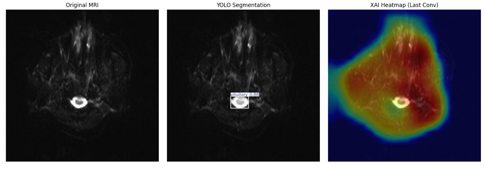
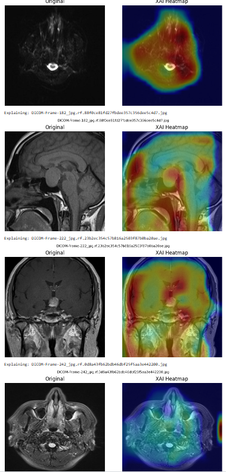

# Project Name: 
Deep Learning-Based Classification and Segmentation Methods for Accurate Brain Tumor Subtype Detection in MRI

# Brain Tumor Detection, Classification, and Segmentation

This project implements an advanced Computer-Aided Diagnosis (CAD) framework for brain tumor analysis using state-of-the-art deep learning architectures. It leverages YOLOv7 and YOLOv8 for high-precision medical imaging tasks.

## 📌 Project Overview
The goal is to provide a high-throughput diagnostic tool that can accurately identify and segment different types of brain tumors (Pituitary, Meningioma, Glioma) from MRI scans. By integrating Explainable AI (XAI), the framework ensures clinical transparency and decision support for healthcare professionals.

## ✨ Features
* **Multi-Task Deep Learning:** Handles detection, classification, and semantic segmentation within a single framework.
* **SOTA Model Benchmarking:** Evaluates YOLOv7/v8 against ResNet, VGG, U-Net, and DeepLabV3+.
* **Advanced Training Techniques:** Uses One-cycle learning rate scheduling and Feature Similarity Penalty (FSP) loss for better accuracy.
* **Explainable AI (XAI):** Features Grad-CAM activation maps for visual interpretability of model predictions.
* **Multi-Class Support:** Specifically tuned for Pituitary, Meningioma, and Glioma subtypes.
* **Clinical Integrity:** Data acquisition and annotation are ethically compliant (IRB-approved).

## 🛠️ Tech Stack
* **Models:** YOLOv7, YOLOv8, ResNet, VGG, U-Net, DeepLabV3+
* **Frameworks:** PyTorch / TensorFlow, OpenCV
* **Visualization:** Grad-CAM, Matplotlib, Seaborn
* **Environment:** Python 3.x, Jupyter Notebook, kaggle
  
## 📊 Visual Results & Interpretability

### 1. Multi-Class Detection & Segmentation
The model accurately identifies and masks tumor regions (e.g., Glioma and Pituitary) across various MRI planes.

### 2. Model Interpretability (XAI Heatmaps)
Using Grad-CAM, we visualize the decision-making process. The heatmaps below show the alignment between the model's focus and the actual pathological regions.

### 3. Comprehensive XAI Benchmarking
Detailed comparison between original MRI frames and their corresponding XAI heatmaps to ensure diagnostic reliability.

## 🚀 Getting Started
1. **Clone:** `git clone https://github.com/Jannatulmawa20/Brain-Tumour.git`
2. **Install:** `pip install -r requirements.txt`
3. **Run:** Open `main_notebook.ipynb` or run `python train.py`

## 📊 Results & Performance
The YOLOv8 architecture, combined with FSP loss, demonstrates superior segmentation resilience and diagnostic precision compared to traditional baselines.

# kaggle link:
https://www.kaggle.com/code/janntulmawa/deep-learning-based-segmentation
